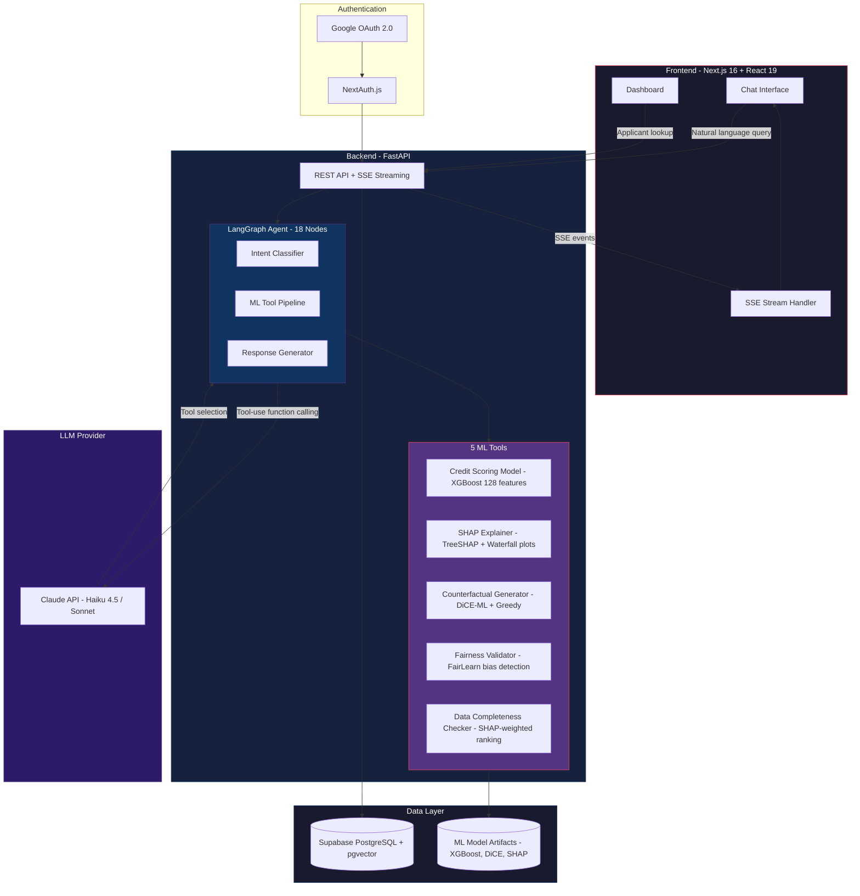
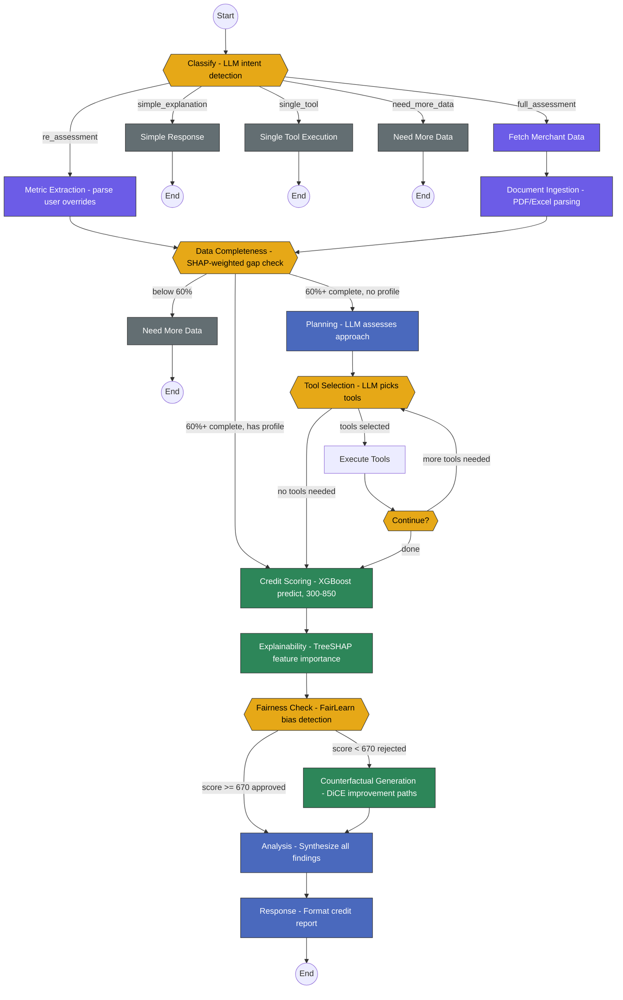
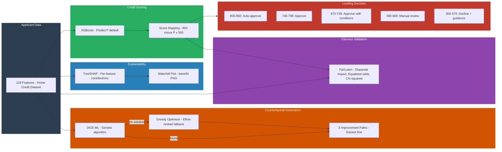
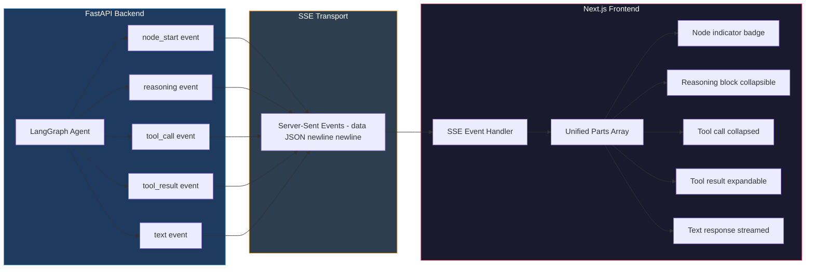
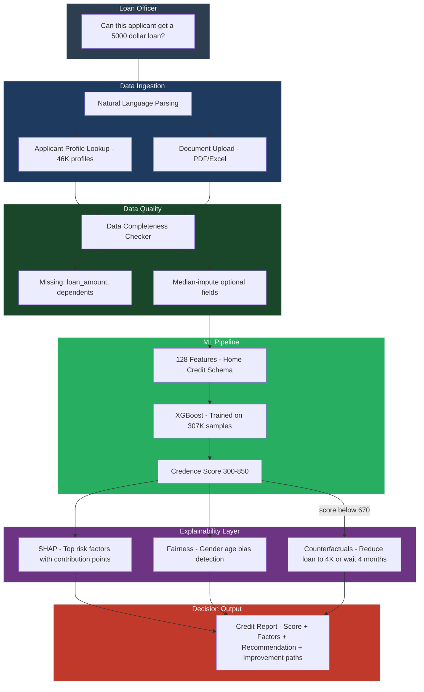

# CreditAI Architecture Diagrams

## 1. System Architecture

---

## 2. LangGraph Agent - Node Workflow

---

## 3. Credit Assessment Pipeline - What Happens Per Query

```mermaid
sequenceDiagram
    actor LO as Loan Officer
    participant UI as Next.js Frontend
    participant API as FastAPI Backend
    participant Agent as LangGraph Agent
    participant LLM as Claude Haiku 4.5
    participant ML as ML Tools

    LO->>UI: Assess applicant 270000
    UI->>API: POST /api/chat SSE stream
    API->>Agent: Initialize state + messages

    rect rgb(40, 40, 70)
        Note over Agent,LLM: Phase 1 - Classification
        Agent->>LLM: Classify intent via structured output
        LLM-->>Agent: intent full_assessment
        Agent-->>UI: SSE node_start classify
    end

    rect rgb(40, 50, 60)
        Note over Agent,ML: Phase 2 - Data Collection
        Agent->>ML: Fetch applicant profile from DB
        ML-->>Agent: 128-feature profile loaded
        Agent->>ML: Check data completeness
        ML-->>Agent: 87% complete SHAP-weighted
        Agent-->>UI: SSE tool_result data_completeness
    end

    rect rgb(30, 60, 50)
        Note over Agent,ML: Phase 3 - ML Scoring Pipeline
        Agent->>ML: credit_scoring_model features
        ML-->>Agent: P default 0.24 Score 718 Band Good
        Agent-->>UI: SSE tool_result credit_score

        Agent->>ML: shap_explainer features
        ML-->>Agent: Top factors + waterfall plot
        Agent-->>UI: SSE tool_result shap

        Agent->>ML: fairness_validator features score
        ML-->>Agent: No demographic bias detected
        Agent-->>UI: SSE tool_result fairness
    end

    rect rgb(50, 40, 60)
        Note over Agent,LLM: Phase 4 - Report Generation
        Agent->>LLM: Synthesize findings into report
        LLM-->>Agent: Structured credit report
        Agent-->>UI: SSE text streaming response
    end

    UI-->>LO: Credit Analysis Report with score factors recommendation
```

---

## 4. Explainability Stack - From Score to Actionable Guidance

---

## 5. Real-Time Streaming Architecture - SSE Event Flow

---

## 6. Data Flow - From Loan Officer to Decision

